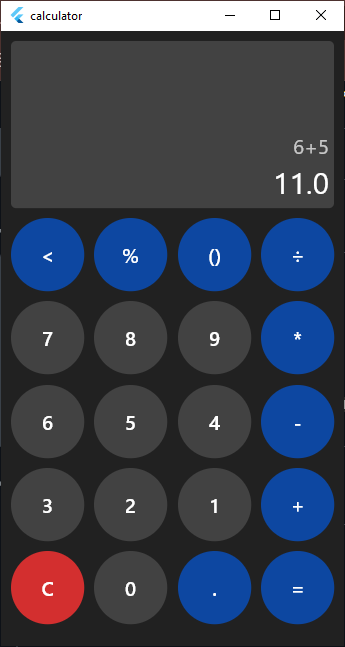

# Documentation

Formatted my phone and found out it did not come preinstalled with a calculator.

Most available ones had **ads** or needed some form of **payment** so I'm making mine.

This application aims to provide a **simple, ad-free alternative** to online or paid **calculator** tools.

# Project Structure
All screen views are placed in __/lib/screen__ with the startup function in __/lib/main.dart__

# Prerequisites
- Flutter sdk
- Any IDE(Andriod Studio / visual studio)
- Jdk
- Device or Emulator

Run ``` flutter doctor ``` to find out others I may have left out🙏

# Run
```
flutter run
```

choose a device and run it on

# View of Application
<p align="center">
  
</p>